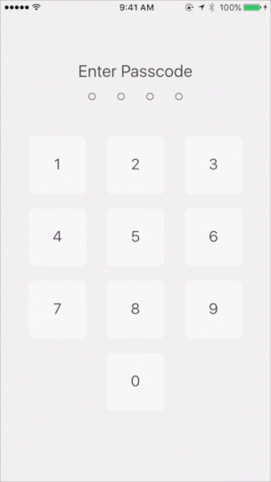
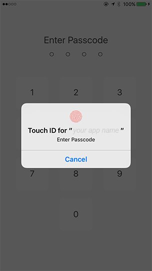

# ionic-lock-screen



## Features

- Themable with CSS
- Supports [Touch ID](https://github.com/AlexDisler/ionic-lock-screen#touch-id-ios-only) on iOS using [cordova-plugin-touchid](https://github.com/leecrossley/cordova-plugin-touchid)

## Install

### NPM

    $ npm install ionic-lock-screen --save

### Bower

    $ bower install ionic-lock-screen --save

## Use

...

## Touch ID (iOS only)



Install [cordova-plugin-touchid](https://github.com/leecrossley/cordova-plugin-touchid)

    $ cordova plugin add cordova-plugin-touchid --save

Set ```touchId:true```

```js
$lockScreen.show({
  code: '1234',
  touchId: true,
});
```

# License

MIT
